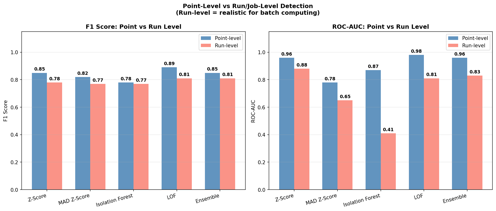
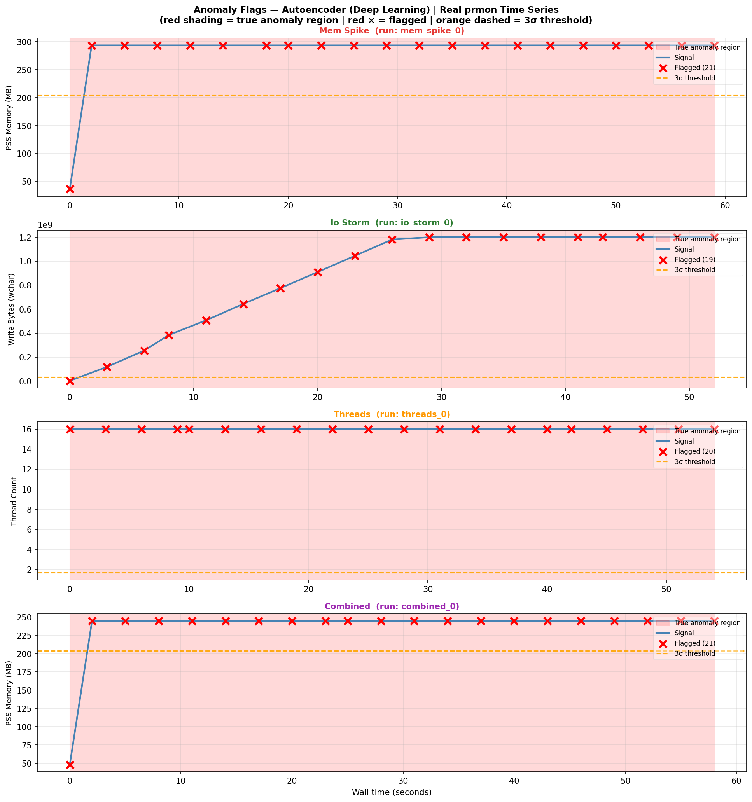
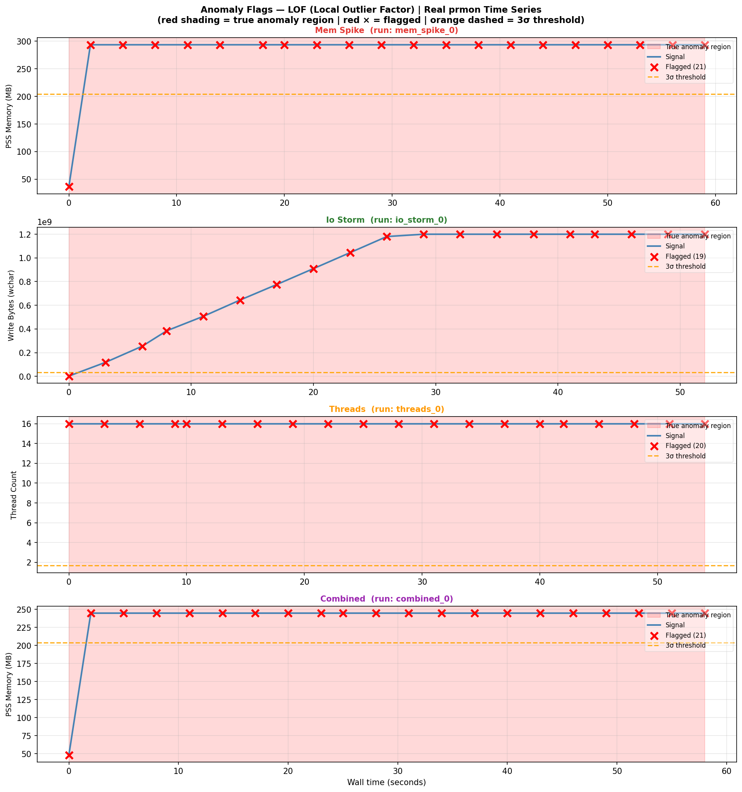
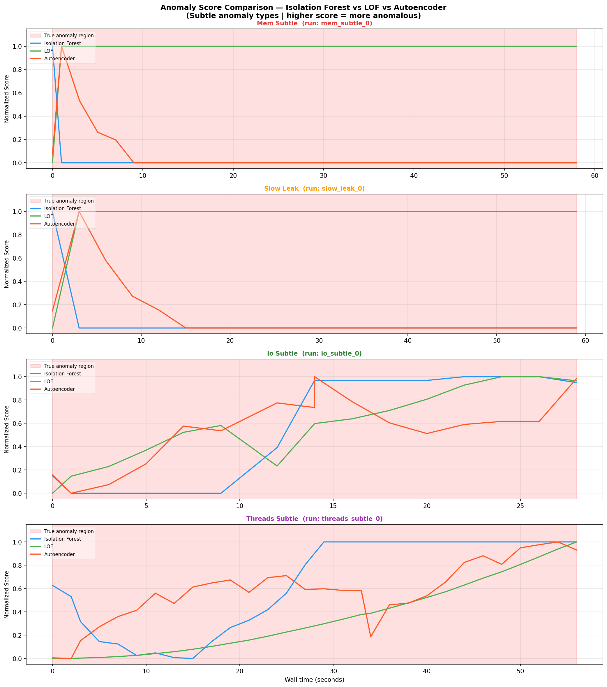

### CERN-HSF Google Summer of Code 2026 — Warm-up Exercise

> **Candidate:** Kazoury Chaimae 
> **Project:** Automated Software Performance Monitoring for the ATLAS experiment  
> **Mentors:** ATLAS Computing Performance Group  
> **AI Disclosure:** See [bottom of this document](#ai-disclosure)

---

## Table of Contents

1. [Project Overview](#1-project-overview)
2. [Environment Setup](#2-environment-setup)
3. [Step 1 — Installing prmon](#3-step-1--installing-prmon)
4. [Step 2 — Collecting Real prmon Data](#4-step-2--collecting-real-prmon-data)
5. [Step 3 — Generating Synthetic Data](#5-step-3--generating-synthetic-data)
6. [Step 4 — Feature Engineering](#6-step-4--feature-engineering)
7. [Step 5 — Anomaly Detection Models](#7-step-5--anomaly-detection-models)
8. [Step 6 — Deep Learning (Autoencoder)](#8-step-6--deep-learning-autoencoder)
9. [Results & Comparison](#9-results--comparison)
10. [Key Plots & Interpretation](#10-key-plots--interpretation)
11. [Trade-offs & Model Selection Guide](#11-trade-offs--model-selection-guide)
12. [Future Improvements](#12-future-improvements)
13. [Resources](#13-resources)
14. [AI Disclosure](#ai-disclosure)

---

## 1. Project Overview

ATLAS software jobs run on the LHC computing grid (WLCG) and are monitored using **prmon** — a lightweight process monitor that records memory, CPU, I/O, and thread metrics at regular intervals during job execution. When a job behaves abnormally (memory leak, I/O storm, thread explosion), it wastes grid resources, delays physics analyses, and can bring down worker nodes.

This project builds a **fully unsupervised anomaly detection pipeline** on top of prmon time-series data. The pipeline:

- Requires **no labels** at inference time (realistic for production)
- Works on a **per-run** basis (flags entire jobs as anomalous)
- Combines **statistical baselines**, **classical ML**, and **deep learning** for robust coverage
- Was validated on three datasets: real prmon data, synthetic data, and a combined set

## What is Process Monitor(prmon)?
It's a program that can monitor the resource consumption of a process .
- Tracks system resource usage:
  - Process-level: CPU, GPU, memory, disk I/O  
  - Device-level: network I/O

- Metrics source:
  - Mostly from **ProcFS**
  - GPU data from **nvidia-smi**
  - Support for additional hardware planned

- Outputs:
  - **Time-series text file** with measurements at each capture
  - **JSON file** with averages, maxima, and hardware information
### Anomaly Types Studied

| Type | Description |
|---|---|
| `mem_spike` | Sudden large memory allocation |
| `mem_subtle` | Slow, gradual memory increase that mimics normal growth |
| `slow_leak` | Classic memory leak — steady linear increase over the full run |
| `io_storm` | Burst of high-volume read/write activity |
| `io_subtle` | Low-amplitude I/O anomaly that stays near normal thresholds |
| `cpu_hog` | CPU usage far above expected baseline |
| `threads` | Thread count explodes well above normal |
| `threads_subtle` | Small but sustained thread count elevation |
| `combined` | Multiple anomaly types co-occurring in the same run |

---

## 2. Environment Setup

### Python dependencies

```bash
# Option A — system install
pip install pandas numpy matplotlib scikit-learn scipy torch jupyter --break-system-packages

# Option B — recommended: It's better to use a virtual environement
python3 -m venv gsoc-env && source gsoc-env/bin/activate
pip install pandas numpy matplotlib scikit-learn scipy torch jupyter
```

### Folder structure used throughout this project

```
Atlas_gsoc26/
├── prmon/                  # cloned & built prmon source
├── data/
│   ├── baseline/           # normal prmon .txt runs
│   ├── anomalous/          # anomalous prmon .txt runs
│   ├── full_dataset_injected.csv    # assembled real dataset
│   └── full_dataset_atlas.csv      # assembled synthetic dataset (with claude ai)
├── notebooks/              # Jupyter analysis notebooks
├── plots/                  # all generated figures
└── gsoc-env/               # Python virtual environment
```

---

## 3. Step 1 — Installing prmon

prmon is a C++ process monitor developed by the HSF. It attaches to a running process and records its resource metrics once per second to a tab-separated text file.

### Clone with submodules

```bash
# --recurse-submodules is required: prmon depends on nlohmann-json and spdlog
git clone --recurse-submodules https://github.com/HSF/prmon.git
```

### Build from source

```bash
cd prmon
mkdir build && cd build

# Configure — install to home dir to avoid needing sudo
cmake -DCMAKE_INSTALL_PREFIX=$HOME/.local -S .. -B .

# Compile using all available CPU cores
make -j$(nproc)

# Install binaries to ~/.local/bin/
make install
```

### Add to PATH

```bash
export PATH="$HOME/.local/bin:$PATH"

# Make permanent across sessions
echo 'export PATH="$HOME/.local/bin:$PATH"' >> ~/.bashrc
source ~/.bashrc
```

### Copy the burner binary manually (if needed)

```bash
# prmon_burner may not be installed automatically
cp ~/Atlas_gsoc26/prmon/build/prmon_burner ~/.local/bin/
```

### Verify installation

```bash
prmon --help
prmon_burner --help
```

### Quick smoke test

```bash
### Quick smoke test

```bash
prmon --interval 1 --filename prmon_test.txt --json-summary prmon_test.json \
  -- prmon_burner --memory 200 --time 10

head -5 prmon_test.txt
```

Expected output — a tab-separated file with columns like:

```
Time    wtime   gpufbmem        gpumempct       gpusmpct        ngpus   pss     rss     swap    vmem    rchar   read_bytes      wchar   write_bytesrx_bytes rx_packets      tx_bytes        tx_packets      stime   utime   nprocs  nthreads
1773191265      0       0       0       0       0       70724   74052   0       201680  6592    159744  88      0       723     6       723     6  00       1       1
1773191267      1       0       0       0       0       98047   101500  0       201680  6592    159744  88      0       1861    14      1861    14 00       1       1
1773191269      3       0       0       0       0       98047   101500  0       201680  6592    159744  88      0       3117    24      3117    24 00       1       1
1773191271      5       0       0       0       0       98047   101500  0       201680  6592    159744  88      0       4383    34      4383    34 00       1       1
```

---

## 4. Step 2 — Collecting Real prmon Data

All runs use `prmon --interval 1` so that one row = one second of process activity. Each run is saved to its own `.txt` file and later assembled into a single dataset.

### Baseline (normal) runs

```bash
cd ~/Atlas_gsoc26

# 35 baseline memory runs
for i in $(seq 1 35); do
    prmon --interval 2 \
          --filename data/baseline/mem_run_${i}.txt \
          --json-summary data/baseline/mem_run_${i}.json \
          --suppress-hw-info \
          -- mem-burner --malloc 200 --sleep 60
done

# 20 baseline I/O runs
for i in $(seq 1 20); do
    prmon --interval 2 \
          --filename data/baseline/io_run_${i}.txt \
          --json-summary data/baseline/io_run_${i}.json \
          --suppress-hw-info \
          -- io-burner --io 50 --threads 1 --pause 1
done

# 15 baseline CPU runs
for i in $(seq 1 15); do
    prmon --interval 2 \
          --filename data/baseline/cpu_run_${i}.txt \
          --json-summary data/baseline/cpu_run_${i}.json \
          --suppress-hw-info \
          -- prmon_burner --threads 1 --time 60
done
```

### Anomalous runs

```bash
# Memory spike — sudden large allocation
for i in $(seq 1 8); do
    prmon --interval 1 \
          --filename data/anomalous/mem_spike_${i}.txt \
          --json-summary data/anomalous/mem_spike_${i}.json \
          -- mem-burner --malloc 600 --sleep 60
    sleep 2
done

# Thread explosion — far more threads than a normal ATLAS job
for i in $(seq 1 8); do
    prmon --interval 1 \
          --filename data/anomalous/threads_${i}.txt \
          --json-summary data/anomalous/threads_${i}.json \
          -- prmon_burner --threads 16 --time 60
    sleep 2
done

# I/O storm — high-frequency disk access
for i in $(seq 1 8); do
    prmon --interval 1 \
          --filename data/anomalous/io_storm_${i}.txt \
          --json-summary data/anomalous/io_storm_${i}.json \
          -- io-burner --io 300 --threads 4 --pause 1
    sleep 2
done

# Combined stress — memory + CPU simultaneously
for i in $(seq 1 5); do
    prmon --interval 1 \
          --filename data/anomalous/combined_${i}.txt \
          --json-summary data/anomalous/combined_${i}.json \
          -- mem-burner --malloc 600 --procs 4 --sleep 60
    sleep 2
done
```
Note that : I have repeated the steps mutiple time to make the dataset larger , resulting in 5838 rows , of course we can do more and generate more data , but due to the time limit , I couldn't add more.
### Verify the collected data

```bash
echo "=== BASELINE ===" && wc -l data/baseline/*.txt
echo "=== ANOMALOUS ===" && wc -l data/anomalous/*.txt
echo "=== TOTAL ROWS ===" && cat data/baseline/*.txt data/anomalous/*.txt | wc -l
```

### Assemble into a single CSV

```python
import os, pandas as pd

def load_prmon_folder(folder, label, anomaly_type="normal"):
    """Load all prmon .txt files from a folder into one DataFrame."""
    frames = []
    for i, fname in enumerate(sorted(os.listdir(folder))):
        if not fname.endswith(".txt"):
            continue
        df = pd.read_csv(os.path.join(folder, fname), sep="\t")
        df["run_id"]       = i
        df["label"]        = label          # 0 = normal, 1 = anomaly
        df["anomaly_type"] = anomaly_type
        frames.append(df)
    return pd.concat(frames, ignore_index=True)

df_normal   = load_prmon_folder("data/baseline",  label=0, anomaly_type="normal")
df_anomalous= load_prmon_folder("data/anomalous", label=1, anomaly_type="various")

df = pd.concat([df_normal, df_anomalous], ignore_index=True)
df.to_csv("data/full_dataset_injected.csv", index=False)
print(f"Dataset shape: {df.shape} | Anomaly ratio: {df['label'].mean():.1%}")
```

**Real dataset summary:** 5,838 rows · 189 runs · **44.8% anomaly ratio**

---

## 5. Step 3 — Generating Synthetic Data

Because real prmon data is limited to the hardware and workload types available locally, we generated a complementary **synthetic dataset** using Claude (Anthropic) to simulate the full range of ATLAS job anomaly patterns at scale.

The synthetic data was designed to reflect realistic resource usage patterns based on the prmon documentation and published ATLAS software performance reports (see [Resources](#13-resources)).

**Why synthetic data?**
- Provides a larger training pool for the deep learning model
- Enables cross-dataset generalisation testing

**Synthetic dataset summary:** 17,372 rows · 216 runs · **53.1% anomaly ratio**

**Combined dataset:** 23,210 rows · 405 runs · **51.0% anomaly ratio**

---

## 6. Step 4 — Feature Engineering

Raw prmon output gives 8 base metrics. We engineer **temporal features** to capture how each metric *changes over time* within a run — which is where anomalous behaviour is most visible.

### Base features

| Feature | Unit | Description |
|---|---|---|
| `pss` | KB | Proportional Set Size — actual physical memory attributed to this process |
| `vmem` | KB | Virtual memory footprint |
| `rss` | KB | Resident Set Size — pages currently in RAM |
| `nthreads` | count | Number of active threads |
| `wchar` | bytes | Characters written to I/O |
| `rchar` | bytes | Characters read from I/O |
| `nprocs` | count | Number of child processes |
| `utime` | ms | User-space CPU time consumed |

> **Note on `pss` vs `rss` vs `vmem`:** `pss` is the most meaningful for grid monitoring — it accounts for shared memory correctly and doesn't double-count pages shared between processes. `vmem` can appear very large even for well-behaved jobs due to memory-mapped files. `rss` is a reasonable proxy but overestimates when shared libraries are involved.

### Engineered features (per run, rolling window of 5 seconds)

For each of `pss`, `nthreads`, `wchar`, `utime`:

```python
for feat in ['pss', 'nthreads', 'wchar', 'utime']:
    # Rolling mean — smoothed signal level
    df[f'{feat}_roll_mean'] = (
        df.groupby('run_id')[feat]
          .transform(lambda x: x.rolling(5, min_periods=1).mean())
    )
    # Rolling std — local volatility; spikes here = unstable behaviour
    df[f'{feat}_roll_std'] = (
        df.groupby('run_id')[feat]
          .transform(lambda x: x.rolling(5, min_periods=1).std().fillna(0))
    )
    # Rate of change — first derivative; catches sudden jumps
    df[f'{feat}_roc'] = (
        df.groupby('run_id')[feat]
          .transform(lambda x: x.diff().fillna(0))
    )
```

This expands the feature set from 8 → **20 features** used in all models.
### Feature engineering — findings

I tested whether adding 12 temporal features (rolling mean, rolling std,
rate-of-change for `pss`, `nthreads`, `wchar`, `utime`) improved detection.
Results were identical to using the 8 raw prmon features alone.
---

## 7. Step 5 — Anomaly Detection Models

### Why unsupervised?

In production, ATLAS jobs arrive unlabelled. A supervised classifier would require thousands of hand-labelled anomalous runs — impractical at grid scale. All five models below learn the *normal* distribution and flag deviations from it.
I already tested supervised models , but as expected they didn't do a really good job in predictions.
---

### Model 1 — Z-Score (Statistical Baseline)

**Idea:** For each feature, compute how many standard deviations a value lies from the run's mean. Flag if any feature exceeds a threshold (default: 3σ).

```python
from scipy import stats

def zscore_detect(group, threshold=3.0):
    z = np.abs(stats.zscore(group[features], nan_policy='omit'))
    score = z.max(axis=1)          # worst-case feature at each timestep
    pred  = (score > threshold).astype(int)
    return score, pred
```

**Why use it:** Zero training required. Interpretable — you can immediately see *which* feature triggered the flag. It only measures how far away a data point from the average. Excellent precision (0.903) means few false alarms, making it safe for alerting operators.

**Limitation:** Assumes roughly Gaussian distributions. Struggles with slow leaks where values drift gradually without ever producing a sharp spike.

---

### Model 2 — MAD (Median Absolute Deviation)

**Idea:** Same as Z-Score but uses the median and MAD instead of mean and std. This makes it robust to the outliers it is trying to detect (a Z-Score inflated by anomalies may miss them).

```python
def mad_detect(group, threshold=3.5):
    median  = group[features].median()
    mad     = (group[features] - median).abs().median()
    score   = ((group[features] - median).abs() / (1.4826 * mad + 1e-8)).max(axis=1)
    pred    = (score > threshold).astype(int)
    return score, pred
```

**Why use it:** More robust than Z-Score when the data itself contains many outliers. In our case it achieves perfect recall (1.000) — it never misses an anomaly — at the cost of more false positives.

---

### Model 3 — Isolation Forest

**Idea:** Build an ensemble of random decision trees. Anomalous points are isolated with fewer splits because they occupy sparse regions of feature space. The anomaly score = average path length to isolation (shorter = more anomalous).

```python
from sklearn.ensemble import IsolationForest

iso = IsolationForest(
    n_estimators=200,      # more trees = more stable scores
    contamination=0.1,     # expected fraction of anomalies in training data
    random_state=42
)
iso.fit(X_train)           # train on normal runs only

scores = -iso.score_samples(X_test)   # negate: higher = more anomalous
preds  = iso.predict(X_test)          # returns +1 (normal) or -1 (anomaly)
preds  = (preds == -1).astype(int)
```

**Why use it:** Handles high-dimensional data well and scales to large datasets. Particularly strong on abrupt anomalies like memory spikes and I/O storms.

**Limitation:** Unreliable on subtle patterns — we observed its score dropping near zero on `threads_subtle` anomalies, meaning it nearly missed them entirely.

---

### Model 4 — Local Outlier Factor (LOF)

**Idea:** For each point, compare its local density to the density of its k nearest neighbours. A point surrounded by sparse neighbours (while its neighbours are densely packed) gets a high outlier score.

```python
from sklearn.neighbors import LocalOutlierFactor

lof = LocalOutlierFactor(
    n_neighbors=20,         # neighbourhood size — larger = more global view
    contamination=0.1,
    novelty=True            # novelty=True allows predict() on new data
)
lof.fit(X_train)

scores = -lof.score_samples(X_test)
preds  = (lof.predict(X_test) == -1).astype(int)
```

**Why use it:** LOF is the most consistent model across all three datasets. It is particularly good at catching subtle anomalies that other models miss. Among all classical ML models tested, it achieved the best F1 score (0.890) and the highest ROC-AUC (0.979) on real data.

**Limitation:** Computationally expensive at large scale (O(n²) for exact k-NN). Slower to react than the autoencoder .

---

### Model 5 — One-Class SVM

**Idea:** Learn a decision boundary in a kernel-mapped feature space that encloses the normal data. Points outside the boundary are anomalies.

```python
from sklearn.svm import OneClassSVM

svm = OneClassSVM(
    kernel='rbf',     # RBF kernel maps data into infinite-dimensional space
    nu=0.1,           # upper bound on fraction of outliers (like contamination)
    gamma='scale'     # auto-scale kernel width to feature variance
)
svm.fit(X_train)

scores = -svm.score_samples(X_test)
preds  = (svm.predict(X_test) == -1).astype(int)
```

**Why use it:** Theoretically well-founded with strong generalisation guarantees. Achieved the highest ROC-AUC among classical models (0.986) on real data — meaning its anomaly *scores* rank anomalies very well, even if its default threshold is not optimal.

**Limitation:** Does not scale well to large datasets. Inference is slow on high-dimensional data. Primarily useful as a comparison benchmark here.

---

### Ensemble

The ensemble combines all five models by majority vote: a point is flagged if at least 3 out of 5 models agree.

---


## 8. Step 6 — Deep Learning (Autoencoder)

### Architecture

An autoencoder is a neural network trained to compress input data into a low-dimensional **latent representation** and then reconstruct it. Trained exclusively on normal data, it learns what "normal" looks like. When it sees an anomalous run, it fails to reconstruct it accurately — producing a high **reconstruction error**.

```
Input (20 features)
    ↓
[Linear 20→32, ReLU]    ← encoder: compress into smaller representation
[Linear 32→16, ReLU]
[Linear 16→8,  ReLU]    ← bottleneck: 8-dimensional latent space
    ↓
[Linear 8→16,  ReLU]    ← decoder: reconstruct original 20 features
[Linear 16→32, ReLU]
[Linear 32→20]          ← output: reconstructed features
```

```python
import torch
import torch.nn as nn

class Autoencoder(nn.Module):
    def __init__(self, input_dim=20):
        super().__init__()
        self.encoder = nn.Sequential(
            nn.Linear(input_dim, 32), nn.ReLU(),
            nn.Linear(32, 16),        nn.ReLU(),
            nn.Linear(16, 8),         nn.ReLU(),
        )
        self.decoder = nn.Sequential(
            nn.Linear(8, 16),         nn.ReLU(),
            nn.Linear(16, 32),        nn.ReLU(),
            nn.Linear(32, input_dim),
        )

    def forward(self, x):
        return self.decoder(self.encoder(x))

# Training — only on normal (label=0) samples
model = Autoencoder(input_dim=20)
optimizer = torch.optim.Adam(model.parameters(), lr=1e-3)
criterion = nn.MSELoss()

for epoch in range(100):
    model.train()
    for batch in train_loader:
        optimizer.zero_grad()
        recon = model(batch)
        loss  = criterion(recon, batch)
        loss.backward()
        optimizer.step()
```

### Anomaly scoring

```python
model.eval()
with torch.no_grad():
    recon = model(X_tensor)
    # Reconstruction error per sample = mean squared error across all 20 features
    reconstruction_error = ((X_tensor - recon) ** 2).mean(dim=1).numpy()

# Threshold = 95th percentile of reconstruction error on NORMAL samples
threshold = np.percentile(reconstruction_error[normal_mask], 95)

ae_pred = (reconstruction_error > threshold).astype(int)
```

### Why the autoencoder outperforms classical models

The autoencoder operates on the *joint* distribution of all 20 features simultaneously. A subtle memory leak might not trigger any single feature's Z-Score threshold, but it creates a consistent *pattern* of correlated deviations across `pss`, `pss_roll_mean`, and `pss_roc` — which the autoencoder's bottleneck representation learns to capture. This is why it reacts earliest and most consistently on subtle anomaly types.

---

## 9. Results & Comparison

### Real prmon dataset

| Model | F1 | Precision | Recall | ROC-AUC |
|---|---|---|---|---|
| Z-Score | 0.851 | **0.903** | 0.804 | 0.962 |
| MAD | 0.824 | 0.700 | 1.000 | 0.779 |
| Isolation Forest | 0.784 | 0.644 | 1.000 | 0.875 |
| LOF | 0.890 | 0.802 | 1.000 | 0.979 |
| One-Class SVM | 0.786 | 0.647 | 1.000 | 0.986 |
| Ensemble | 0.849 | 0.738 | 1.000 | 0.964 |
| **Autoencoder** | **0.957** | **0.941** | **0.974** | **0.994** |

### Synthetic dataset

| Model | F1 | Precision | Recall | ROC-AUC |
|---|---|---|---|---|
| Z-Score | 0.830 | 0.942 | 0.742 | 0.850 |
| LOF | 0.810 | 0.699 | 0.963 | 0.960 |
| Autoencoder | 0.853 | 0.946 | 0.777 | 0.895 |

### Combined dataset

| Model | F1 | Precision | Recall | ROC-AUC |
|---|---|---|---|---|
| LOF | 0.819 | 0.695 | **0.997** | 0.974 |
| Autoencoder | 0.679 | **0.918** | 0.539 | 0.790 |

### Interpreting the combined dataset drop

The autoencoder's F1 drops to 0.679 on the combined dataset. This is **expected and not a model failure.** 

### General interpretation 
**LOF** measures *local* density rather than global distance. A subtle
anomaly may look normal compared to the full dataset, but within its
local neighbourhood it stands out as unusually sparse .

**The Autoencoder** learns the *joint structure* of all 20 features
simultaneously(captures *correlations between features*). When an anomalous run breaks the normal co-occurrence
pattern  reconstruction error rises, even if no single
feature crosses a threshold. This is the core weakness of Z-Score and
MAD: they evaluate each feature independently and miss anomalies that
are only visible in feature combinations, because the feature may be related to each other , and one affect another .

---

## 10. Key Plots & Interpretation

### Time-series anomaly flags



*Each panel shows a different anomaly type. Red vertical bands = model-flagged intervals. The dashed line = 3σ threshold above the normal mean. The autoencoder flags anomalies early and maintains consistent coverage.*



*LOF flags are similarly accurate but slightly delayed compared to the autoencoder, particularly visible on `mem_subtle`.*

### Summary 
Each panel shows one anomaly type over wall time — blue line is the raw
prmon signal, red markers are flagged timesteps, and the orange dashed
line is the 3σ threshold from normal runs. The autoencoder reacts from
the first seconds of the anomalous region because its reconstruction
error rises as soon as the *joint pattern* of features breaks, even
before any single feature crosses the threshold — most visible on
`mem_subtle` and `threads_subtle`. LOF (below) achieves similar
detection rates but reacts more gradually, needing several consecutive
anomalous timesteps before its local density estimate shifts enough to
trigger a flag. On large obvious anomalies like `mem_spike` and
`io_storm`, both models are indistinguishable.

### Score comparison on subtle anomalies



*This is the most informative plot. Normalised anomaly scores (0–1) for Isolation Forest, LOF, and Autoencoder on the two hardest anomaly types.*

**Key observations:**
- **`io_subtle`**: Autoencoder reacts earliest (scores elevate from t=0). Isolation Forest catches up around t=13s. LOF rises gradually over the full run duration.
- **`threads_subtle`**: Isolation Forest score drops near zero around t=10s — it almost completely misses this anomaly. Autoencoder stays consistently elevated throughout. LOF shows intermediate behaviour.

### Point-level vs run-level detection


*Run-level detection (right) aggregates point-level flags: a run is anomalous if ≥10% of its timesteps are flagged. This reduces noise from transient spikes and is the operationally relevant metric for ATLAS grid monitoring.*

---

## 11. Trade-offs & Model Selection Guide

| Scenario | Recommended Model | Reason |
|---|---|---|
| Real-time alerting, low false alarm tolerance | Z-Score | Best precision (0.903), zero training needed, fully interpretable |
| Must-catch-everything (safety-critical) | MAD or Ensemble | Perfect recall (1.000) — never misses an anomaly |
| Best overall balanced performance | **Autoencoder** | Best F1 (0.957), ROC-AUC (0.994), earliest detection on subtle types |
| Consistent performance across unknown data | LOF | Most stable F1 across all three datasets |
| Explainability required for operators | Z-Score or MAD | Score = "feature X deviated by Nσ" — directly actionable |
| Resource-constrained deployment | Z-Score | No model file, no GPU, runs in microseconds |

**The autoencoder is the recommended production model** for scenarios where:
1. A GPU or sufficient CPU is available for inference
2. A representative normal dataset is available for training
3. Balanced precision/recall is preferred over maximising one at the expense of the other

---

## 12. Future Improvements

Given more time, the following directions would strengthen this pipeline:

1. **Run-level aggregation.** Current flags are per-timestep. A proper run-level classifier (e.g., count of flagged seconds / run length > threshold) would reduce noise and is more actionable for grid operators.

2. **Anomaly-type classification.** Rather than just flagging a run as anomalous, a second-stage classifier could identify *which* type of anomaly is present, directly informing the on-call engineer.

3. **Larger real prmon dataset.** The real dataset (5,838 rows, 189 runs) is relatively small. Access to production ATLAS grid monitoring data would allow training a far more robust model.

---

## 13. Resources

- [prmon GitHub repository](https://github.com/HSF/prmon)
- [prmon documentation — metrics reference](https://github.com/HSF/prmon/blob/main/doc/METRICS.md)
- [ATLAS Software Performance Monitoring TWiki](https://twiki.cern.ch/twiki/bin/view/AtlasComputing/AtlasSoftwarePerformanceMonitoring) *(CERN login required)*
- [scikit-learn: Novelty and Outlier Detection](https://scikit-learn.org/stable/modules/outlier_detection.html)
- [Isolation Forest paper — Liu et al. 2008](https://doi.org/10.1109/ICDM.2008.17)
- [LOF paper — Breunig et al. 2000](https://doi.org/10.1145/335191.335388)
- [prmon Detail and explanation](https://indico.cern.ch/event/813751/contributions/3991506/attachments/2099462/3529369/prmon_mete.pdf)
- ATLAS prmon metrics understanding was informed by the prmon documentation and the HSF CWP Software Performance section.

---

## AI Disclosure

In accordance with the GSoC application guidelines, the following components of this project used AI assistance (Claude, Anthropic):

| Component | AI Role |
|---|---|
| **Code comments** | Claude helped write clear inline explanations for the model implementations and feature engineering code |
| **Results discussion** | Claude helped structure the narrative interpretation of model metrics and plot observations |
| **Visualisation design** | Claude suggested the normalised score comparison plot approach for subtle anomaly comparison |
| **Synthetic data generation** | The `full_dataset_atlas.csv` synthetic dataset was generated with Claude's assistance, simulating realistic ATLAS job anomaly patterns based on the prmon documentation |
| **README structure** | Claude helped organise and write this document from rough notes and code |
